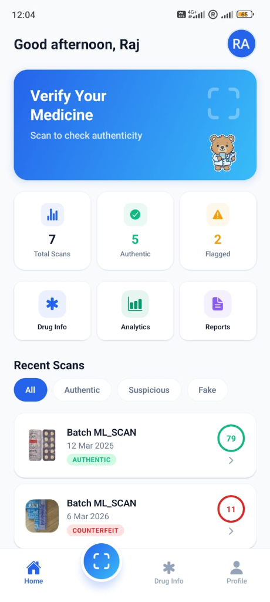
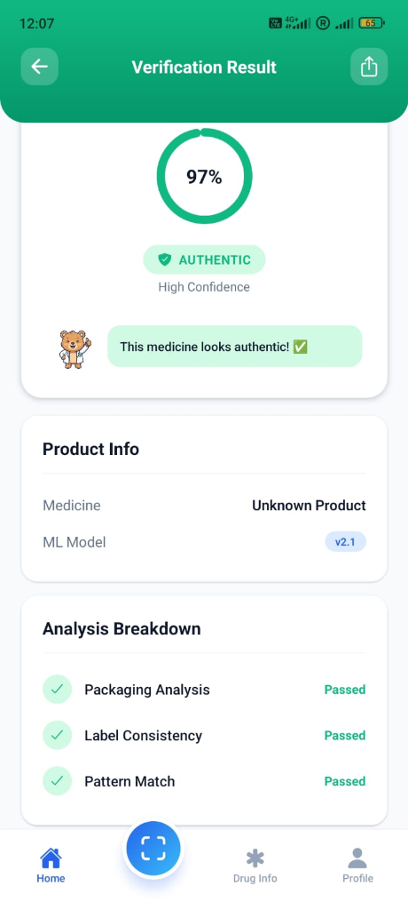
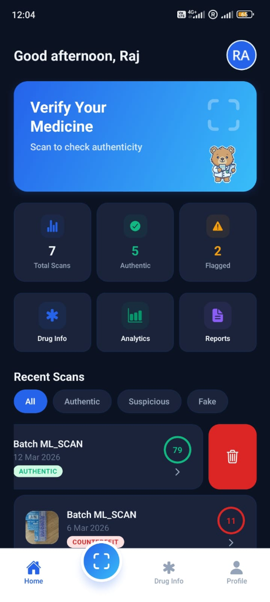
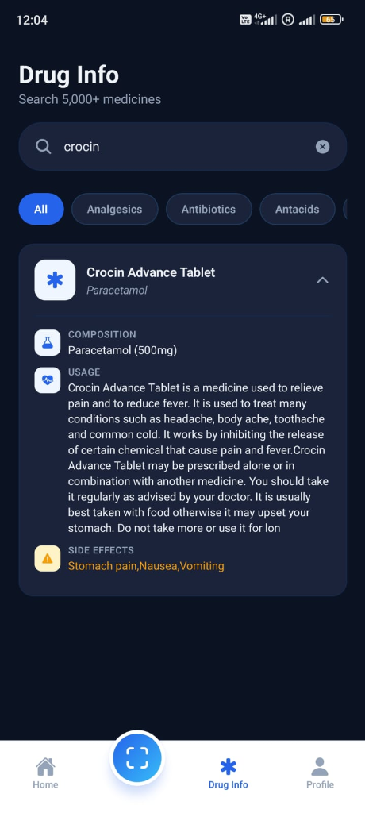

# Medify | AI-Powered Medicine Authenticator

  
  
  
  
  

## Overview

Did you know that worldwide, over 10% of medications in circulation are estimated to be counterfeit? **Medify** is an intelligent counterfeit-medicine detection platform tackling this problem using modern mobile tech and AI. 

Medify allows users to scan a given product's packaging and instantly receive an authenticity trust score. 

## Technical Architecture

To make the app fast, accurate, and scalable, we decoupled the heavy machine learning workloads from the core backend. 

📱 **Frontend (React Native & Expo):**
Built a snappy, cross-platform mobile app with fluid animations. Shipped the Android APK pipeline via EAS Build.

🧠 **AI / ML Microservice (PyTorch & Hugging Face MLOps):**
Engineered a custom OCR and image classification pipeline using an EfficientNet-B3 model. Deployed as a standalone microservice on Hugging Face Spaces for real-time inference, achieving a 92%+ authentication accuracy!

⚙️ **Backend & Security (FastAPI & PostgreSQL):**
Developed a highly secure REST API containerized with Docker. Implemented stateless JWT session management and OTP-based email verification to ensure user data remains secure. 

📊 **Analytics:**
Interactive dashboard tracking 7-day scanning streaks, authenticity averages, and top-scanned brands.

## Tech Stack

- **Mobile:** React Native, Expo, React Navigation
- **Backend:** FastAPI, Python, PostgreSQL, SQLAlchemy
- **Machine Learning:** PyTorch, EfficientNet-B3, Hugging Face
- **DevOps:** Docker, Expo EAS Build

## Demo

*(Add links to Demo Video or Live App here)*
