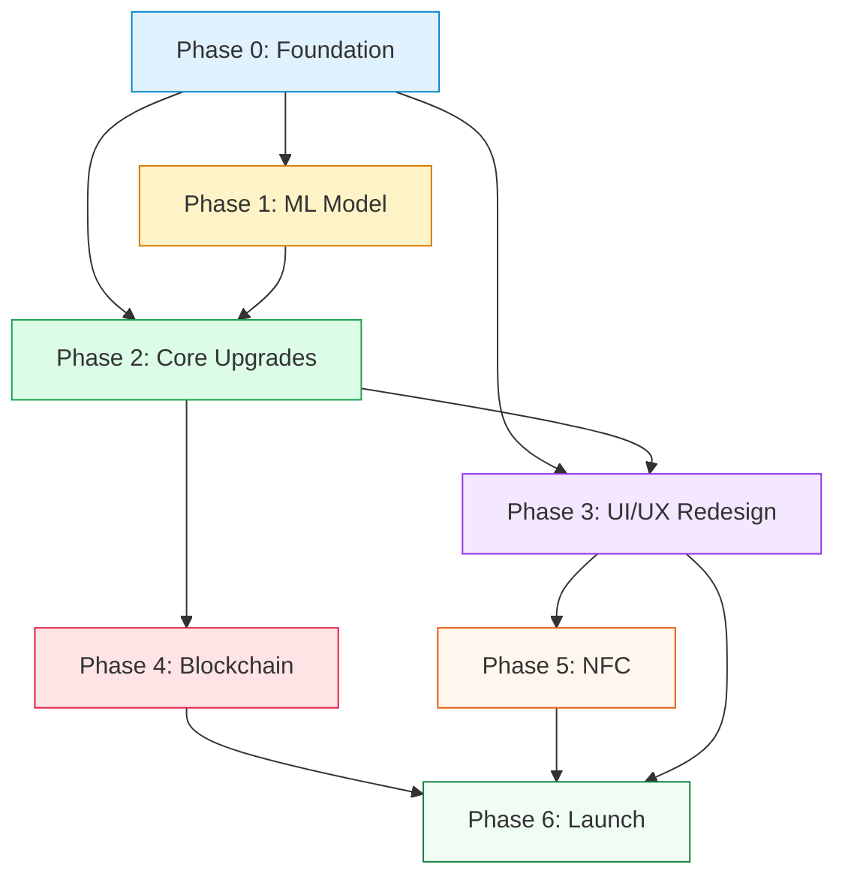

# AuthChecker — Development Phases Guide

**Reference:** [PRD.md](file:///d:/Projects/auth-checker/docs/PRD.md)  
**Last Updated:** February 16, 2026

This document is the **hands-on execution guide** for transforming the AuthChecker MVP into a production-ready application. Each phase is broken down into actionable tasks with technical details, file-level changes, commands to run, acceptance criteria, and dependencies.

---

## Phase 0: Foundation (Weeks 1–2)

> **Goal:** Prepare the codebase, infrastructure, and development workflow so that all subsequent phases can be executed efficiently and safely.

### Why This Phase Exists

The current codebase has no CI/CD, no test suite, hardcoded secrets, a monolithic frontend, and runs entirely on localhost. Before adding any features or training ML models, we need a solid foundation — otherwise every future change will be risky and slow.

### 0.1 — Set Up CI/CD Pipeline

**What:** Create a GitHub Actions workflow that runs on every push/PR.

**Tasks:**
- Create `.github/workflows/ci.yml` with jobs for:
  - **Backend lint + test:** `flake8` → `pytest`
  - **Mobile lint:** `eslint` → `jest`
  - **Docker build:** Build the Docker image to verify it's not broken
- Add branch protection rules on `main` (require passing CI before merge)

**Acceptance Criteria:**
- Every PR triggers automated checks
- Failing tests block merge to `main`

---

### 0.2 — Restructure Mobile App

**What:** Break the monolithic `mobile/App.js` (733 lines) into a proper screen/component architecture.

**Current Problem:**
- All 4 screens (Login, Home, Profile, Result) live in a single file
- Navigation uses `useState('login')` — no proper navigation library
- Impossible to maintain or test individual screens

**Tasks:**
- Install `@react-navigation/native` + `@react-navigation/stack`
- Create directory structure:
  ```
  mobile/
  ├── src/
  │   ├── screens/
  │   │   ├── LoginScreen.js
  │   │   ├── HomeScreen.js
  │   │   ├── ProfileScreen.js
  │   │   ├── ResultScreen.js
  │   │   └── AnalyticsScreen.js    (placeholder)
  │   ├── components/
  │   │   ├── UI.js                 (existing, move here)
  │   │   ├── TrustRing.js
  │   │   ├── HistoryCard.js
  │   │   ├── CustomTabBar.js
  │   │   └── LoadingOverlay.js
  │   ├── navigation/
  │   │   └── AppNavigator.js
  │   ├── services/
  │   │   └── api.js                (axios instance + interceptors)
  │   ├── context/
  │   │   └── AuthContext.js        (user state, token management)
  │   └── utils/
  │       └── constants.js
  ├── App.js                        (just wraps AppNavigator)
  ├── theme.js
  └── config.js
  ```
- Extract each screen from the current `App.js` into its own file
- Move authentication state into a React Context (`AuthContext`)
- Move API calls into `services/api.js`

**Acceptance Criteria:**
- `App.js` is under 30 lines (just wraps providers + navigator)
- Each screen file is self-contained
- App functions identically to before (visual regression check)

---

### 0.3 — Set Up Cloud Environment

**What:** Deploy the backend to a cloud service so it's accessible beyond localhost.

**Tasks (Option A — Free Tier):**
- Create a [Render](https://render.com) account
- Connect the GitHub repo
- Create a Web Service pointing to the `Dockerfile`
- Set environment variables (`DATABASE_URL`, `SECRET_KEY`)
- Create a [Supabase](https://supabase.com) project for PostgreSQL
- Run `db/schema.sql` against the Supabase database
- Update `mobile/config.js` to point to the Render URL

**Tasks (Option B — Enterprise):**
- Set up AWS/GCP account with billing alerts
- Deploy Docker via ECS Fargate / Cloud Run
- Provision RDS PostgreSQL instance
- Run schema migration
- Configure load balancer + custom domain

**Acceptance Criteria:**
- API is reachable from the internet at `https://<your-service>.onrender.com/docs` (or equivalent)
- Mobile app can register, login, and scan against the cloud backend

---

### 0.4 — Fix Security Issues

**What:** Eliminate all hardcoded secrets and insecure defaults before going public.

**Files to Change:**
- `backend/server.py` — Replace `SECRET_KEY = "supersecretkey123"` with `os.getenv("SECRET_KEY")` and **require** it (no default)
- `backend/server.py` — Change `allow_origins=["*"]` to a whitelist of allowed origins
- `backend/.env` — Add to `.gitignore` if not already; generate a strong random `SECRET_KEY` via:
  ```bash
  python -c "import secrets; print(secrets.token_urlsafe(64))"
  ```
- Ensure `ACCESS_TOKEN_EXPIRE_MINUTES` is reduced from 600 to a reasonable value (e.g., 60)

**Acceptance Criteria:**
- No secrets in source code
- `.env` is in `.gitignore`
- CORS rejects requests from unauthorized origins

---

### 0.5 — Establish Testing Framework

**What:** Set up pytest for the backend and Jest for the mobile app.

**Backend Tasks:**
- Create `backend/tests/` directory
- Install `pytest`, `pytest-asyncio`, `httpx` (for async test client)
- Write baseline tests:
  - `test_health.py` — API health check
  - `test_auth.py` — Register, login, invalid credentials
  - `test_scan.py` — Upload image, receive response (mock ML)
- Create `conftest.py` with test database fixture (SQLite in-memory or test Supabase)

**Mobile Tasks:**
- Ensure `jest` is configured in `package.json`
- Write baseline tests for:
  - `AuthContext` — login/logout state transitions
  - `api.js` — API call mocking with axios-mock-adapter

**Acceptance Criteria:**
- `pytest` passes with ≥ 5 backend tests
- `npm test` passes with ≥ 3 mobile tests
- Tests run in CI pipeline

---

## Phase 1: ML Model Development (Weeks 3–6)

> **Goal:** Train a deep learning image-classification model that achieves ≥ 92% accuracy on the fake-vs-real medicine task, then permanently remove the OCR pipeline.

### Why This Phase Exists

The OCR + batch-matching approach is fundamentally unreliable. Text extraction fails on curved/glossy surfaces, and batch IDs can be trivially copied. A visual ML model that learns packaging patterns (print quality, color fidelity, hologram presence) is the only path to trustworthy verification.

### 1.1 — Dataset Acquisition & Preparation

**Datasets to Download:**

| ID | Source | Action |
|---|---|---|
| A | [Fake vs Real Medicine (Kaggle)](https://www.kaggle.com/datasets/surajkumarjha1/fake-vs-real-medicine-datasets-images) | Download, extract, use as primary training set |
| B | [Indian Pharma Products (Kaggle)](https://www.kaggle.com/datasets/rishgeeky/indian-pharmaceutical-products) | Download, use for visual diversity reference |
| C | [Indian Medicine Data (Kaggle)](https://www.kaggle.com/datasets/mohneesh7/indian-medicine-data) | Download, supplement training if labeled |
| D | [Counterfeit Med Detection (Roboflow)](https://universe.roboflow.com/harshini-t-g-r/counterfeit_med_detection) | Download, extract bounding-box crops for augmentation |
| E | [WHO Medicines Quality DB (PMC)](https://pmc.ncbi.nlm.nih.gov/articles/PMC3865552/) | Research reference — understand counterfeit characteristics |

**Tasks:**
- Create directory structure:
  ```
  ml/
  ├── data/
  │   ├── raw/           (downloaded datasets — gitignored)
  │   ├── processed/     (cleaned, resized images)
  │   ├── train/
  │   │   ├── real/
  │   │   └── fake/
  │   ├── val/
  │   │   ├── real/
  │   │   └── fake/
  │   └── test/
  │       ├── real/
  │       └── fake/
  ├── scripts/
  │   ├── download_data.py
  │   ├── preprocess.py
  │   └── augment.py
  ├── training/
  │   ├── train.py        (replaces old ml/model/train.py)
  │   ├── evaluate.py
  │   └── config.yaml
  ├── inference/
  │   └── engine.py       (NEW — ML-based, replaces OCR engine)
  └── model/
      └── (saved model weights — gitignored)
  ```
- Write `preprocess.py`:
  - Remove corrupted/unreadable images
  - Standardize labels to `real/` and `fake/` folders
  - Resize all images to 256×256 (training will random-crop to 224×224)
  - Compute dataset statistics (mean, std for normalization)
- Write `augment.py`:
  - Random horizontal flip
  - Random rotation (±15°)
  - Color jitter (brightness ±0.2, contrast ±0.2, saturation ±0.2)
  - Random resized crop (80–100%)
  - Gaussian blur (σ = 0.1–2.0)
  - JPEG compression simulation (quality 30–100)
- Split data: **70% train, 15% validation, 15% test** (stratified by class)
- Add `ml/data/` to `.gitignore`

**Acceptance Criteria:**
- Clean, balanced dataset with known class distribution
- Train/val/test splits created with no data leakage
- All preprocessing is reproducible via scripts

---

### 1.2 — Model Training

**Tasks:**
- Create `ml/training/config.yaml`:
  ```yaml
  model:
    backbone: efficientnet_b3
    pretrained: true
    num_classes: 2
    dropout: 0.3
  training:
    epochs: 50
    batch_size: 32
    learning_rate: 0.0001
    weight_decay: 0.00001
    scheduler: cosine_annealing_warm_restarts
    early_stopping_patience: 7
    freeze_backbone_epochs: 5
  data:
    input_size: 224
    normalize_mean: [0.485, 0.456, 0.406]
    normalize_std: [0.229, 0.224, 0.225]
  ```
- Write `ml/training/train.py`:
  - Load EfficientNet-B3 from `torchvision.models` with ImageNet weights
  - Replace classifier head: `AdaptiveAvgPool → Dropout(0.3) → FC(1536, 256) → ReLU → Dropout(0.2) → FC(256, 2)`
  - Phase 1 (epochs 1–5): Freeze backbone, train only head (lr=1e-4)
  - Phase 2 (epochs 6–50): Unfreeze all, differential lr (backbone=1e-5, head=1e-4)
  - Use `CrossEntropyLoss` with class weights (computed from training set distribution)
  - Log metrics to console + CSV (or MLflow/W&B if set up)
  - Save best model checkpoint (by validation loss)
  - Save training curves (loss, accuracy per epoch)
- Set up experiment tracking:
  - Option A: [Weights & Biases](https://wandb.ai) (free for personal projects)
  - Option B: [MLflow](https://mlflow.org) (self-hosted, open source)

**Commands:**
```bash
# From project root
python -m ml.training.train --config ml/training/config.yaml
```

**Acceptance Criteria:**
- Training completes without errors
- Validation accuracy trend is upward and converges
- Best model checkpoint is saved to `ml/model/`

---

### 1.3 — Model Evaluation

**Tasks:**
- Write `ml/training/evaluate.py`:
  - Load best model checkpoint
  - Run inference on the held-out **test set** (never seen during training)
  - Compute and print:
    - **Accuracy** (target: ≥ 92%)
    - **Precision** for the Fake class (target: ≥ 90%)
    - **Recall** for the Fake class (target: ≥ 95%)
    - **F1 Score** (target: ≥ 92%)
    - **AUC-ROC** (target: ≥ 0.96)
  - Generate and save:
    - **Confusion matrix** (as image)
    - **ROC curve** (as image)
    - **Grad-CAM** visualizations for 10 random test images (verify the model looks at packaging features, not background)
  - Save evaluation report as `ml/reports/evaluation_report.md`

**Acceptance Criteria:**
- All target metrics are met
- Grad-CAM shows the model attends to meaningful regions (text, hologram, print quality)
- If targets are NOT met → iterate on data augmentation, try different backbone (ResNet-50, EfficientNet-B4), or gather more training data before proceeding

---

### 1.4 — New Inference Engine

**Tasks:**
- Write new `ml/inference/engine.py`:
  ```python
  class MLInferenceEngine:
      def __init__(self, model_path: str):
          # Load TorchScript / ONNX model
          # Set up preprocessing pipeline (resize, normalize)
      
      def predict(self, image_bytes: bytes) -> dict:
          # Preprocess image
          # Run model inference
          # Return { "label": "REAL"|"FAKE", "confidence": 0.0-1.0 }
  ```
- Convert best PyTorch model to **TorchScript** or **ONNX** for optimized inference:
  ```bash
  python -m ml.scripts.export_model --format onnx --checkpoint ml/model/best.pth
  ```
- Update `backend/server.py`:
  - Replace `from ml.inference.engine import InferenceEngine` with `from ml.inference.engine import MLInferenceEngine`
  - Replace the entire scan pipeline logic (OCR → regex → batch match → trust score) with:
    ```python
    result = ml_engine.predict(image_bytes)
    # result = { "label": "REAL", "confidence": 0.97 }
    ```
  - Simplify `compute_trust_score` to use ML confidence as the primary signal

**Acceptance Criteria:**
- Inference latency ≤ 3 seconds on target hardware (CPU)
- API returns correct predictions for known real and fake test images
- Existing API contract (`/api/v1/scan` response shape) is maintained

---

### 1.5 — OCR Removal

> **This is a one-way migration. The OCR method will never be used again.**

**Files to Delete:**
- `ml/inference/engine.py` (the old OCR wrapper — already replaced by new ML engine)
- `ml/model/medicine_model.pth` (dummy SiameseNetwork weights)
- `ml/model/train.py` (old dummy training script)
- `debug_ocr.log`
- `ocr_debug/` directory

**Code to Remove from `backend/server.py`:**
- `normalize_batch()` function
- `extract_dates_from_text()` function
- `mfg_exp_valid()` function
- `fuzzy_match_brand_manufacturer()` function
- `decode_barcode_from_bytes()` function
- All batch-matching logic in the `/api/v1/scan` endpoint
- Imports: `PaddleOCR`, `pytesseract`, `pyzbar`, `thefuzz`

**Dependencies to Remove from `requirements.txt`:**
- `paddleocr`
- `paddlepaddle`
- `pytesseract`
- `pyzbar`
- `thefuzz`
- `albumentations` (if unused by new pipeline)

**Acceptance Criteria:**
- `pip install -r requirements.txt` completes without installing OCR packages
- Docker image size is significantly reduced
- All backend tests still pass
- No OCR-related code remains in the codebase

## Phase 1.5: Serverless ML Deployment — HuggingFace Spaces ✅

> **Goal:** Move ML inference off Render (512MB RAM, OOM crashes) to a dedicated free-tier inference host with sufficient resources (16GB RAM).

### Why This Phase Exists

The EfficientNet-B3 model requires ~800MB RAM to load plus peak inference spikes. Render Free Tier only provides 512MB, causing instant OOM kills during model loading. AWS Lambda was considered but ruled out due to account constraints. HuggingFace Spaces provides free Docker hosting with 16GB RAM and no credit card requirement.

### Architecture Decision

**Split Architecture:**
- **Render (Free):** Auth, users, database, scan history, API gateway
- **HuggingFace Space (Free):** ML inference only — receives image, returns `{label, confidence}`

```
Phone → Render (/scan) → HuggingFace Space (/predict) → Render → Phone
```

### Files Created

| File | Purpose |
|------|---------|
| `hf_space/app.py` | FastAPI with `/predict` and `/health` endpoints |
| `hf_space/inference_engine.py` | Self-contained EfficientNet-B3 inference engine |
| `hf_space/config.yaml` | Model architecture config (inference-only) |
| `hf_space/requirements.txt` | CPU-only PyTorch + FastAPI + dependencies |
| `hf_space/Dockerfile` | Python 3.9-slim, non-root user, port 7860 |

### Files Modified

| File | Change |
|------|--------|
| `backend/server.py` | Replaced local `MLInferenceEngine` with `httpx` call to HF Space |
| `requirements.txt` | Removed PyTorch/torchvision/sklearn; added `httpx` |
| `mobile/src/screens/HomeScreen.js` | Axios timeout → 30s for cold starts |

### Environment Variables

| Key | Value | Where |
|-----|-------|-------|
| `HF_SPACE_URL` | `https://Aki030-auth-checker-ml.hf.space` | Render Dashboard |

### Acceptance Criteria

- [x] HuggingFace Space builds and `/health` returns 200
- [x] `/predict` returns correct ML predictions
- [x] Render builds without PyTorch (fast builds, no OOM)
- [x] `HF_SPACE_URL` env var configured on Render
- [ ] Keep-alive ping configured (UptimeRobot) to prevent sleep

---

## Phase 2: Core Platform Upgrades (Weeks 7–10)

> **Goal:** Build proper user management, comprehensive scan history, and essential features that make the app useful beyond just scanning.

### 2.1 — Email Verification & Password Reset

**Backend Tasks:**
- Create new database tables:
  - `email_verifications` (user_id, otp_code, expires_at, verified)
  - `password_resets` (user_id, reset_token, expires_at, used)
- Add `is_verified` boolean field to `users` table
- Implement email sending:
  - Use a free transactional email service ([Resend](https://resend.com) — 3,000 emails/month free, or [Brevo](https://brevo.com) — 300/day free)
  - Create email templates for: verification OTP, password reset link
- New API endpoints:
  - `POST /api/v1/verify-email` — accept OTP, mark user verified
  - `POST /api/v1/resend-verification` — resend OTP
  - `POST /api/v1/forgot-password` — send reset token via email
  - `POST /api/v1/reset-password` — accept token + new password
- Add validation: unverified users cannot use `/api/v1/scan`

**Mobile Tasks:**
- Add OTP input screen after registration
- Add "Forgot Password?" link on login screen
- Add password reset flow (email → OTP → new password)

**Acceptance Criteria:**
- Users receive verification email within 10 seconds of registration
- Unverified users see a prompt to verify email
- Password reset flow works end-to-end

---

### 2.2 — Refresh Token Rotation

**Backend Tasks:**
- Create `user_sessions` table (user_id, refresh_token, device_info, ip_address, expires_at, revoked)
- Modify login to return both `access_token` (15 min) and `refresh_token` (7 days)
- New endpoint: `POST /api/v1/refresh` — accept refresh token, return new token pair, revoke old refresh token
- New endpoint: `POST /api/v1/logout` — revoke the refresh token
- New endpoint: `GET /api/v1/sessions` — list active sessions
- New endpoint: `DELETE /api/v1/sessions/{id}` — revoke specific session

**Mobile Tasks:**
- Store refresh token securely (Expo SecureStore)
- Add axios interceptor: on 401 → attempt token refresh → retry original request
- On refresh failure → redirect to login

**Acceptance Criteria:**
- Access tokens expire in 15 minutes
- App seamlessly refreshes tokens without user interruption
- User can view and revoke active sessions

---

### 2.3 — Comprehensive Scan History

**Backend Tasks:**
- Add fields to `scan_history`:
  - `image_thumbnail_url` (S3/R2 URL for the scanned image)
  - `ml_confidence` (float)
  - `ml_model_version` (string)
  - `result_breakdown_json` (JSONB — full ML output)
  - `blockchain_tx_hash` (string, nullable — populated later in Phase 4)
  - `nfc_verified` (boolean, default false — used in Phase 5)
- Update `POST /api/v1/scan` to:
  - Upload scan image to object storage (Cloudflare R2 or S3)
  - Save thumbnail URL in `scan_history`
  - Store full ML result breakdown
- Update `GET /api/v1/history` to support:
  - Pagination: `?page=1&per_page=20`
  - Filtering: `?status=AUTHENTIC&from=2026-01-01&to=2026-02-16`
  - Sorting: `?sort=date_desc` | `?sort=score_asc`
- New endpoint: `GET /api/v1/history/{scan_id}` — full detail view
- New endpoint: `DELETE /api/v1/history/{scan_id}` — soft delete (set `deleted_at`)

**Mobile Tasks:**
- Rebuild history list with pagination (infinite scroll)
- Add filter pills (All / Authentic / Suspicious / Fake)
- Add date range picker
- Create scan detail screen:
  - Scanned image (loaded from object storage)
  - Trust score ring
  - ML confidence
  - Full result breakdown
  - Blockchain verification link (placeholder for Phase 4)
- Implement server-synced deletion (not just local state)

**Acceptance Criteria:**
- History loads progressively (no lag on 100+ scans)
- Filters and date range work correctly
- Scan detail screen shows full information
- Deletion syncs with backend

---

### 2.4 — Image Storage

**Tasks:**
- Set up object storage:
  - **Option A:** Cloudflare R2 (free: 10 GB, no egress fees)
  - **Option B:** AWS S3 (pay per use)
- Install Python SDK (`boto3` for S3, `boto3`-compatible for R2)
- Create utility module: `backend/storage.py`
  ```python
  def upload_scan_image(image_bytes: bytes, scan_id: str) -> str:
      """Upload image, return public URL."""
  
  def delete_scan_image(scan_id: str) -> None:
      """Delete image from storage."""
  ```
- Modify scan endpoint to upload images and store URL
- Remove local `uploads/` directory dependency
- Delete the background cleanup task (`cleanup_old_uploads` in server.py)

**Acceptance Criteria:**
- Scan images are stored in cloud object storage
- URLs are accessible from the mobile app
- No images stored on the application server

---

### 2.5 — Drug Information Lookup

**Backend Tasks:**
- Create `drug_information` table:
  - `id`, `brand_name`, `generic_name`, `composition`, `usage`, `side_effects`, `manufacturer`, `category`
- Seed with data from public drug databases (e.g., [OpenFDA API](https://open.fda.gov/apis/), Indian pharmacopoeia references)
- New endpoint: `GET /api/v1/drugs/{brand_name}` — return drug info
- Link drug info to scan results (auto-display when a scanned medicine is identified)

**Mobile Tasks:**
- Create Drug Info screen (accessible from scan result + searchable)
- Display: composition, usage instructions, common side effects, manufacturer info
- Add search functionality for drug lookup

**Acceptance Criteria:**
- Database contains info for ≥ 50 common Indian medicines
- Drug info displays correctly in scan results and dedicated screen

---

### 2.6 — Counterfeit Reporting

**Backend Tasks:**
- Create `counterfeit_reports` table (already in schema.sql, expand it):
  - `id`, `user_id`, `scan_id`, `description`, `pharmacy_name`, `pharmacy_location`, `geo_lat`, `geo_long`, `status` (pending/reviewed/resolved), `reported_at`
- New endpoints:
  - `POST /api/v1/reports` — submit counterfeit report
  - `GET /api/v1/reports` — user's own reports
  - `GET /api/v1/reports/{id}` — report details

**Mobile Tasks:**
- Add "Report Counterfeit" button on scan result screen (when status is FAKE or SUSPICIOUS)
- Create report form: description, pharmacy details, auto-fill GPS location
- Show user's submitted reports in profile section

**Acceptance Criteria:**
- Users can submit reports linked to specific scans
- Reports are stored with location data
- Users can view status of their reports

---

### 2.7 — Security Hardening

**Tasks:**
- Enforce HTTPS (TLS termination handled by Render/load balancer)
- Restrict CORS to specific origins
- Add Helmet-style security headers (via FastAPI middleware):
  - `X-Content-Type-Options: nosniff`
  - `X-Frame-Options: DENY`
  - `Strict-Transport-Security`
- Implement request input sanitization
- Add HMAC request signing for critical endpoints (scan, report)
- Review and fix all `# TODO` and `# FIXME` comments

**Acceptance Criteria:**
- Security headers present on all responses
- CORS rejects unauthorized origins
- No sensitive data exposed in error responses

---

## Phase 3: UI/UX Redesign (Weeks 11–14)

> **Goal:** Transform the app from a developer prototype into a consumer-grade product with premium aesthetics, smooth interactions, and accessibility.

### 3.1 — Figma Design

**Tasks:**
- Design screens in Figma (or similar):
  - Onboarding (3-slide intro carousel)
  - Login / Register (with social login placeholders)
  - Home Dashboard
  - Scan Camera / Upload flow
  - Scan Result (with animation)
  - Scan History (list + detail)
  - Analytics Dashboard (charts and visualizations)
  - Notifications Center
  - Drug Information
  - Profile & Settings
- Define design system:
  - Color palette (primary, secondary, success, danger, neutral shades)
  - Typography scale (headings, body, captions)
  - Component library (buttons, cards, inputs, badges, pills, modals)
  - Spacing and sizing tokens
  - Dark mode color palette

**Acceptance Criteria:**
- All screens designed and annotated
- Design system documented
- Designs reviewed and approved before implementation

---

### 3.2 — Navigation Overhaul

**Tasks:**
- Implement React Navigation with:
  - **Auth Stack:** Onboarding → Login / Register → Email Verification
  - **Main Tab Navigator:** Home | Analytics | (FAB Scan) | Notifications | Profile
  - **Nested Stacks:** Scan Result, Scan Detail, Drug Info, Report Form, Settings
- Add smooth screen transitions (slide, fade)
- Implement deep linking for notification taps

**Acceptance Criteria:**
- Navigation feels native and fluid
- Back gestures work correctly on both platforms
- Tab bar matches Figma design

---

### 3.3 — Screen Implementation

**Tasks:**
- Implement all screens from Figma designs
- Key screen details:
  - **Onboarding:** Animated carousel with auto-advance, skip button, dot indicators
  - **Home:** Greeting header, quick action cards, recent scans summary
  - **Analytics:** Charts and stat cards (see FR-8 in PRD)
  - **Notifications:** Grouped by date, swipe-to-dismiss, unread indicators
  - **Profile:** Avatar, stats, settings list, dark mode toggle, logout
- Implement skeleton loading screens (shimmer effect) for all data-loading states
- Implement error states with retry buttons
- Add haptic feedback on key interactions (scan result, button presses)

**Acceptance Criteria:**
- All screens pixel-perfect match to Figma designs
- Loading and error states are graceful
- Animations are smooth (60 fps)

---

### 3.4 — Notifications Implementation

**Backend Tasks:**
- Integrate **Firebase Cloud Messaging (FCM)** for push notifications
- Add `fcm_token` field to `users` table
- New endpoint: `POST /api/v1/devices/register` — store device FCM token
- Create notification triggers:
  - Expiry reminder (cron job checks expiring medicines daily)
  - Regional counterfeit alert (when new reports filed nearby)
  - Blockchain confirmation (when tx_hash is recorded)
- Create `notifications` table for in-app notification history

**Mobile Tasks:**
- Integrate `expo-notifications` for push notification handling
- Build notification center screen
- Add notification preferences in settings

**Acceptance Criteria:**
- Push notifications arrive on device within 30 seconds
- In-app notification center shows history with read/unread states
- Users can toggle notification categories

---

### 3.5 — Analytics Dashboard

**Mobile Tasks:**
- Install charting library: `react-native-chart-kit` or `victory-native`
- Build Analytics screen with:
  - **Stat Cards:** Total scans, authentic %, fake %, streak days (with count-up animations)
  - **Scan Timeline:** Bar chart — scans per day/week/month (toggle)
  - **Authenticity Breakdown:** Animated donut chart — Authentic vs Suspicious vs Fake
  - **Trust Score Trend:** Line chart — average confidence over time
  - **Top Brands:** Horizontal bar chart — most frequently scanned medicines

**Backend Tasks:**
- New endpoint: `GET /api/v1/analytics` — return aggregated stats:
  ```json
  {
    "total_scans": 47,
    "authentic_count": 38,
    "suspicious_count": 6,
    "fake_count": 3,
    "average_confidence": 84.2,
    "scans_by_day": [ { "date": "2026-02-15", "count": 5 }, ... ],
    "top_brands": [ { "name": "Paracip-500", "count": 12 }, ... ],
    "confidence_trend": [ { "date": "2026-02-15", "avg": 87.3 }, ... ]
  }
  ```

**Acceptance Criteria:**
- All charts render with smooth animations
- Charts are responsive to different screen sizes
- Data updates reflect new scans in real-time (on screen focus)
- Visual styling is premium (gradients, rounded bars, smooth curves)

---

### 3.6 — Dark Mode & Polish

**Tasks:**
- Create dark color palette in `theme.js`
- Implement theme context with persistence (AsyncStorage)
- Add toggle in Settings
- Ensure all screens and components respect the active theme
- Comprehensive bug fix pass (test on Android + iOS)
- Accessibility audit: screen reader labels, touch target sizes (≥ 44×44), contrast ratios

**Acceptance Criteria:**
- Dark mode looks polished (not just inverted colors)
- Toggle persists across app restarts
- No accessibility issues flagged by automated scanning tools

---

## Phase 4: Blockchain Integration (Weeks 15–17)

> **Goal:** Add an immutable on-chain audit trail for every scan verification, providing transparency and trustworthiness.

### 4.1 — Smart Contract Development

**Tasks:**
- Write Solidity smart contract (`contracts/AuthCheckerVerification.sol`):
  ```solidity
  // SPDX-License-Identifier: MIT
  pragma solidity ^0.8.19;
  
  contract AuthCheckerVerification {
      struct ScanRecord {
          bytes32 resultHash;
          uint256 timestamp;
      }
      
      mapping(bytes32 => ScanRecord) public scans;
      address public owner;
      
      modifier onlyAuthorized() { require(msg.sender == owner); _; }
      
      function recordScan(bytes32 scanId, bytes32 resultHash) external onlyAuthorized;
      function verifyScan(bytes32 scanId) external view returns (bytes32, uint256);
  }
  ```
- Set up Hardhat / Foundry development environment
- Write unit tests for the contract
- Deploy to **Polygon Amoy testnet** (Mumbai has been deprecated, Amoy is the current Polygon testnet)
- Verify contract on Polygonscan

**Acceptance Criteria:**
- Contract deploys and functions correctly on testnet
- `recordScan` and `verifyScan` work as expected
- Contract is verified and readable on Polygonscan

---

### 4.2 — Backend Blockchain Worker

**Tasks:**
- Install `web3.py` Python library
- Create `backend/blockchain.py` module:
  - Wallet management (load private key from environment variable)
  - Contract interaction (ABI + address)
  - Hash computation: `SHA256(scan_id + label + confidence + timestamp)`
  - Transaction submission with retry logic + gas estimation
- Create async worker (background task or queue consumer):
  - Listen for new scan results
  - Compute result hash
  - Submit `recordScan` transaction
  - Update `scan_history.blockchain_tx_hash` with transaction hash
- Handle failures gracefully (retry queue, dead-letter logging)

**Acceptance Criteria:**
- Every scan result gets recorded on-chain within 60 seconds
- Transaction hash is stored in the database
- Failed transactions are retried up to 3 times

---

### 4.3 — User-Facing Verification

**Mobile Tasks:**
- Add "Verify on Blockchain" button on scan detail screen
- Tapping opens the transaction on Polygonscan (via deep link / WebView)
- Show blockchain status indicator on scan history cards:
  - ⏳ Pending (no tx_hash yet)
  - ✅ Confirmed (tx_hash present)

**Backend Tasks:**
- New endpoint: `GET /api/v1/verify-blockchain/{scan_id}` — return:
  - Transaction hash
  - Block number
  - On-chain result hash
  - Match verification (does on-chain hash match recomputed hash?)

**Acceptance Criteria:**
- Users can independently verify any scan on Polygonscan
- Verification status is clearly communicated in the UI

---

### 4.4 — Mainnet Deployment

**Tasks:**
- Audit smart contract (manual review + automated tools like Slither)
- Deploy contract to **Polygon PoS mainnet**
- Fund API wallet with MATIC for gas fees
- Set up gas price monitoring and alerts
- Update backend to point to mainnet contract

**Acceptance Criteria:**
- Contract is live on Polygon mainnet
- API wallet has sufficient MATIC balance
- Monitoring alerts if balance drops below threshold

---

## Phase 5: NFC Integration (Weeks 18–20)

> **Goal:** Add hardware-based verification using NFC tags to prevent physical cloning of legitimate product codes.

### 5.1 — Mobile NFC Module

**Tasks:**
- Install `react-native-nfc-manager`
- Note: NFC requires a **bare React Native project** (not Expo Go) — use EAS Build or pre-built dev client
- Create `src/services/nfc.js`:
  - Check device NFC capability
  - Read NFC tag (UID + NDEF payload)
  - Parse manufacturer-signed payload: `{ productId, batchId, serialNumber, signature }`
- Add NFC scan button on home screen (visible only if device supports NFC)
- Build NFC scanning UI (animated tap indicator, success/failure feedback)

**Acceptance Criteria:**
- NFC tag reading works on NFC-capable Android devices
- Non-NFC devices gracefully hide the NFC option
- Tag data is correctly parsed and sent to backend

---

### 5.2 — Backend NFC Verification

**Tasks:**
- New endpoint: `POST /api/v1/verify-nfc`
  - Accept: `{ tag_uid, payload, signature }`
  - Verify signature using manufacturer's public key
  - Check tag UID against known-tags database
  - Return verification result
- Create `nfc_tags` table: `tag_uid`, `product_id`, `batch_id`, `serial_number`, `manufacturer_public_key`, `registered_at`
- Integrate NFC result into composite trust score:
  - With NFC: ML (50%) + NFC (40%) + Blockchain (10%)
  - Without NFC: ML (80%) + Blockchain (20%)

**Acceptance Criteria:**
- Valid NFC tags return verified status
- Tampered/unknown tags return failure
- Trust score correctly incorporates NFC signal

---

### 5.3 — Manufacturer Integration (Pilot)

**Tasks:**
- Define NFC tag specification for manufacturers:
  - Tag type: NTAG 424 DNA (AES-128 mutual authentication)
  - Payload format: JSON schema
  - Signature algorithm: ECDSA P-256
- Create manufacturer onboarding documentation
- Set up test tags for development (order NTAG 424 DNA development kit)
- Plan pilot with 1–2 pharmaceutical manufacturers

**Acceptance Criteria:**
- Technical specification document is complete
- Development NFC tags are programmed and testable
- At least 1 manufacturer engagement initiated

---

## Phase 6: Launch Preparation (Weeks 21–24)

> **Goal:** Final polish, testing, and public release.

### 6.1 — Performance Optimization

**Tasks:**
- Profile API response times — identify and fix bottlenecks
- Optimize ML inference:
  - Quantize model (INT8) for faster CPU inference
  - Benchmark: target ≤ 2s inference on free-tier hardware
- Optimize mobile app:
  - Image list virtualization (FlatList optimization)
  - Reduce bundle size (tree-shaking, lazy loading)
  - Cache API responses where appropriate
- Load test backend: use [k6](https://k6.io) or [Locust](https://locust.io) to simulate 100+ concurrent users

**Acceptance Criteria:**
- API p95 latency ≤ 500ms (non-ML endpoints)
- ML inference p95 ≤ 3 seconds
- App doesn't crash or lag under normal usage

---

### 6.2 — Security Testing

**Tasks:**
- Run automated security scanning:
  - `bandit` (Python static analysis)
  - `safety` (dependency vulnerability check)
  - `npm audit` (JavaScript dependency check)
- Manual penetration testing checklist:
  - SQL injection attempts
  - JWT token manipulation
  - File upload exploitation
  - Rate limit bypass attempts
  - CORS policy verification
- Fix all critical and high-severity findings

**Acceptance Criteria:**
- Zero critical/high vulnerabilities
- Security scan reports documented

---

### 6.3 — App Store Submission

**Tasks:**
- Prepare store listing assets:
  - App icon (512×512, 1024×1024)
  - Screenshots (phone + tablet, light + dark mode)
  - Feature graphic (Google Play)
  - App description, keywords, category
  - Privacy policy URL
- Build production APK/AAB (Android) via EAS Build
- Build production IPA (iOS) via EAS Build
- Submit to:
  - **Google Play Console** — Internal testing → Closed beta → Production
  - **Apple App Store Connect** — TestFlight → App Review → Release
- Handle review feedback and resubmission if needed

**Acceptance Criteria:**
- App accepted on Google Play Store
- App accepted on Apple App Store (if targeting iOS)
- Both listings have professional assets and descriptions

---

### 6.4 — Monitoring & Alerting

**Tasks:**
- Set up Grafana Cloud dashboards:
  - API request rate and latency
  - Error rate (4xx, 5xx)
  - ML inference latency
  - Database query performance
  - Blockchain transaction success rate
  - User registration/login events
- Configure alerts:
  - Error rate > 5% → Slack/email notification
  - API latency p95 > 1s → warning
  - Blockchain wallet balance low → critical
  - Server downtime → critical (immediate)
- Set up structured JSON logging (replace print statements with proper logger)

**Acceptance Criteria:**
- Dashboard provides real-time visibility into system health
- Critical alerts trigger notifications within 1 minute
- All backend logging uses structured format

---

### 6.5 — Beta Program & Launch

**Tasks:**
- Recruit 20–50 beta testers (friends, family, pharmacy contacts)
- Create feedback form (Google Forms or in-app feedback)
- Run beta for 2 weeks
- Triage and fix reported issues
- Prepare launch announcement
- Go live! 🚀

**Acceptance Criteria:**
- Beta feedback is collected and critical issues are resolved
- App is stable under real-world usage
- Public launch is smooth with no critical issues in first 48 hours

---

## Phase Dependencies Diagram



> **Key dependency:** Phase 1 (ML) and Phase 2 (Core Upgrades) can partially overlap once Phase 0 is complete. Phase 3 (UI/UX) should wait until Phase 2 APIs are ready so screens are built against final endpoints.

---

**This document should be used as the step-by-step execution guide. Check off items as you complete them and update this file with any learnings, blockers, or scope changes.**
