# AuthChecker — Product Requirements Document (PRD)

**Version:** 2.0  
**Date:** February 16, 2026  
**Authors:** Product & Engineering Team  
**Status:** Draft — Pending Stakeholder Approval  
**Repository:** [auth-checker](file:///d:/Projects/auth-checker)

---

## Table of Contents

1. [Executive Summary](#1-executive-summary)
2. [Problem Statement](#2-problem-statement)
3. [Goals & Objectives](#3-goals--objectives)
4. [Current Limitations (MVP Audit)](#4-current-limitations-mvp-audit)
5. [Functional Requirements](#5-functional-requirements)
6. [Non-Functional Requirements](#6-non-functional-requirements)
7. [System Architecture](#7-system-architecture)
8. [ML System Design](#8-ml-system-design)
9. [Blockchain Integration](#9-blockchain-integration)
10. [NFC Hardware Integration](#10-nfc-hardware-integration)
11. [User Management](#11-user-management)
12. [Deployment Strategy](#12-deployment-strategy)
13. [Security Requirements](#13-security-requirements)
14. [Roadmap & Phases](#14-roadmap--phases)
15. [Risks & Mitigation](#15-risks--mitigation)
16. [Future Scope](#16-future-scope)

---

## 1. Executive Summary

**AuthChecker** is a mobile-first platform designed to help consumers verify the authenticity of pharmaceutical products. Users photograph a medicine strip and receive a trust score indicating whether the product is **Authentic**, **Suspicious**, or **Fake**.

### Current State

A Minimum Viable Product (MVP) has been developed with the following stack:

| Layer | Technology | Key Files |
|---|---|---|
| Mobile Client | React Native / Expo | [App.js](file:///d:/Projects/auth-checker/mobile/App.js), [theme.js](file:///d:/Projects/auth-checker/mobile/theme.js) |
| Backend API | FastAPI (Python) | [server.py](file:///d:/Projects/auth-checker/backend/server.py) |
| Inference Engine | PaddleOCR + Tesseract | [engine.py](file:///d:/Projects/auth-checker/ml/inference/engine.py) |
| ML Model (Placeholder) | PyTorch SiameseNetwork | [train.py](file:///d:/Projects/auth-checker/ml/model/train.py) |
| Database | PostgreSQL via SQLAlchemy | [database.py](file:///d:/Projects/auth-checker/backend/database.py), [models.py](file:///d:/Projects/auth-checker/backend/models.py) |
| Containerization | Docker Compose | [docker-compose.yml](file:///d:/Projects/auth-checker/docker-compose.yml) |

### Vision

Transform this MVP into a **production-ready, secure, scalable, and intelligent** anti-counterfeiting platform by:

1. Replacing the unreliable OCR pipeline with a trained **Deep Learning image-classification model**.
2. Hosting the backend on **cloud infrastructure** for global accessibility.
3. Redesigning the **UI/UX** for consumer-grade polish.
4. Expanding the **feature set** beyond single-scan verification.
5. Adding **blockchain** transparency and **NFC** hardware verification layers.

---

## 2. Problem Statement

Counterfeit medicines are a critical global health threat. The WHO estimates that **1 in 10 medical products** in low- and middle-income countries is substandard or falsified. India's pharmaceutical market — the world's largest supplier of generic medicines — is particularly vulnerable.

AuthChecker aims to empower consumers and pharmacists to verify medicine authenticity instantly using their smartphones. However, the current MVP suffers from fundamental reliability, scalability, and usability issues that make it unsuitable for real-world deployment.

### Core Issues Identified

| # | Problem | Severity | Category |
|---|---|---|---|
| 1 | OCR-based authentication is unreliable and easily spoofed | 🔴 Critical | Accuracy |
| 2 | Backend runs on localhost — inaccessible to external users | 🔴 Critical | Infrastructure |
| 3 | UI/UX is basic, buggy, and not production-grade | 🟡 High | User Experience |
| 4 | Only one feature (scan) — insufficient for product value | 🟡 High | Product |
| 5 | Scan history is limited; no persistent user data | 🟡 High | Data |
| 6 | No immutable audit trail — trust deficit | 🟠 Medium | Trust |
| 7 | QR/barcode codes can be cloned onto fake products | 🟠 Medium | Security |

---

## 3. Goals & Objectives

### Primary Goals

| Goal | Success Metric | Target |
|---|---|---|
| **Accuracy** — Replace OCR with ML model | Model accuracy on test set | ≥ 92% |
| **Availability** — Cloud-hosted backend | Uptime SLA | ≥ 99.5% |
| **Usability** — Redesigned UI/UX | User satisfaction (post-survey) | ≥ 4.2/5.0 |
| **Trust** — Blockchain audit trail | Verification records on-chain | 100% of scans |
| **Security** — NFC integration | Unclonable verification rate | ≥ 95% |

### Secondary Goals

- Expand feature set to include **drug information lookup**, **expiry alerts**, and **counterfeit reporting**.
- Implement proper **user profile management** with login persistence.
- Achieve full **scan history** with rich data visualization.
- Deliver a build pipeline suitable for **Play Store / App Store** distribution.

---

## 4. Current Limitations (MVP Audit)

### 4.1 Unreliable Authentication System

> [!CAUTION]
> The current verification engine is the single biggest risk to product credibility. It **must** be replaced before any public deployment.

**Current Implementation** — [engine.py](file:///d:/Projects/auth-checker/ml/inference/engine.py):

- Uses a dual-engine OCR approach: **Tesseract** (lines 127–138) + **PaddleOCR** (lines 140–151).
- Extracts raw text from a medicine strip image.
- Attempts to find a **Batch ID** via regex strategies:
  - Keyword search (`BATCH`, `B.NO`, `LOT`).
  - Fuzzy matching against known batch numbers.
  - Pattern-based extraction (alphanumeric sequences).
- Matches extracted batch ID against `valid_medicines` table in PostgreSQL.
- Trust score is computed via a weighted formula in [server.py#compute_trust_score](file:///d:/Projects/auth-checker/backend/server.py#L287-L377).

**Why This Fails:**

| Issue | Details |
|---|---|
| OCR accuracy | Text extraction is unreliable on curved surfaces, low-contrast prints, and glossy packaging. |
| Spoofing | Batch IDs are public information — trivially copyable to counterfeit packaging. |
| No visual intelligence | The system cannot detect visual differences between genuine and fake packaging. |
| No real ML model | [train.py](file:///d:/Projects/auth-checker/ml/model/train.py) trains on **random noise** (line 35: `torch.randn(3, 224, 224)`) — it is a placeholder, not a real model. |
| Fragile regex | Batch extraction relies on 4+ regex strategies with extensive special-casing, indicating fundamental approach fragility. |

### 4.2 Server Hosting

**Current State:**

- Backend server runs locally via [run_server.bat](file:///d:/Projects/auth-checker/run_server.bat).
- Mobile app connects via hardcoded LAN IP in [config.js](file:///d:/Projects/auth-checker/mobile/config.js).
- Docker Compose exists but is configured for local development only.

**Impact:** The application is completely inaccessible outside the local network.

### 4.3 UI/UX Quality

**Current State** — [mobile/App.js](file:///d:/Projects/auth-checker/mobile/App.js) (733 lines, single file):

- All screens (Login, Home, Profile, Result) are in a **single monolithic file**.
- Navigation is managed via `useState('login')` — no proper navigation library.
- Several UI bugs reported.
- Profile page settings (Notifications, Security) are **non-functional placeholders**.
- No onboarding flow, no loading skeletons, no error boundary handling.

### 4.4 Feature Limitation

The app currently has one user-facing feature: **Scan a medicine image and view the result.**

| Missing Features | Priority |
|---|---|
| Drug information lookup | High |
| Expiry date alerts & reminders | High |
| Counterfeit reporting to authorities | High |
| Push & in-app notifications | High |
| Personal analytics dashboard | High |
| Scan result sharing | Medium |
| Community-based alerts | Medium |
| Pharmacy locator | Low |

### 4.5 History & User Data Storage

**Current State:**

- History endpoint (`/api/v1/history`) returns the **10 most recent scans** — no pagination, no filtering.
- Scan history items show only `product`, `status`, `date`, `score` — no images, no detailed breakdown.
- Local deletion in-app (via swipe) only removes from state, **not from database**.
- No password reset mechanism.
- No email verification.
- No session management beyond JWT (600-minute expiry, no refresh tokens).

### 4.6 No Blockchain Verification

- All verification data lives solely in a centralized PostgreSQL database.
- Users and regulators have no independent way to audit or verify data integrity.
- Records can theoretically be altered by the database administrator.

### 4.7 No Hardware-Based Verification

- If a valid QR/barcode is photocopied onto fake packaging, the system cannot detect the clone.
- The `scan_count` field in [models.py](file:///d:/Projects/auth-checker/backend/models.py#L32) is a rudimentary clone detection mechanism (flags serial numbers scanned > 10 times) — this is easily circumvented.

---

## 5. Functional Requirements

### FR-1: ML-Based Verification Engine

| ID | Requirement | Priority |
|---|---|---|
| FR-1.1 | The system shall classify medicine images as **Authentic** or **Counterfeit** using a trained deep learning model. | P0 |
| FR-1.2 | The model shall achieve ≥ 92% accuracy on a held-out test set. | P0 |
| FR-1.3 | Inference latency shall be ≤ 3 seconds per image on the target deployment hardware. | P0 |
| FR-1.4 | The system shall provide a **confidence score** (0–100) alongside the classification label. | P0 |
| FR-1.5 | The system shall support incremental model updates without full redeployment. | P1 |
| FR-1.6 | The old OCR pipeline shall be fully deprecated and removed after successful ML model deployment. | P0 |

### FR-2: User Management

| ID | Requirement | Priority |
|---|---|---|
| FR-2.1 | Users shall register with username, email, and password (with validation). | P0 |
| FR-2.2 | Users shall log in with username/email and password. | P0 |
| FR-2.3 | The system shall support **password reset** via email OTP. | P1 |
| FR-2.4 | The system shall support **email verification** on registration. | P1 |
| FR-2.5 | Users shall view and edit their profile (name, email, avatar). | P1 |
| FR-2.6 | The system shall implement **refresh token** rotation for session management. | P1 |
| FR-2.7 | Users shall be able to delete their account and all associated data (GDPR compliance). | P2 |

### FR-3: Scan History

| ID | Requirement | Priority |
|---|---|---|
| FR-3.1 | The system shall store complete scan records including image thumbnail, ML result, confidence score, GPS coordinates, timestamp, and product details. | P0 |
| FR-3.2 | Users shall browse full scan history with **pagination** and **date filtering**. | P0 |
| FR-3.3 | Users shall view detailed breakdown of any historical scan. | P1 |
| FR-3.4 | Users shall delete individual scan records (soft-delete with server sync). | P1 |
| FR-3.5 | Users shall export scan history as PDF report. | P2 |

### FR-4: Blockchain Verification

| ID | Requirement | Priority |
|---|---|---|
| FR-4.1 | Each scan verification result shall be hashed and recorded on-chain. | P1 |
| FR-4.2 | Users shall verify any scan result against the blockchain record independently. | P1 |
| FR-4.3 | The system shall support **Polygon** as the primary network (low gas fees, EVM-compatible). | P1 |
| FR-4.4 | A smart contract shall store scan hashes mapped to scan IDs and timestamps. | P1 |

### FR-5: NFC Hardware Verification

| ID | Requirement | Priority |
|---|---|---|
| FR-5.1 | The system shall read NFC tags embedded in medicine packaging via the device's NFC reader. | P2 |
| FR-5.2 | NFC tag data shall be verified against the backend database and blockchain. | P2 |
| FR-5.3 | NFC verification shall produce a separate trust signal combined with the ML model result. | P2 |

### FR-6: Additional Features

| ID | Requirement | Priority |
|---|---|---|
| FR-6.1 | Users shall view **drug information** (composition, usage, side effects) for scanned products. | P1 |
| FR-6.2 | Users shall set **expiry reminders** for medicines they've scanned. | P2 |
| FR-6.3 | Users shall **report counterfeits** with description, images, and location data. | P1 |
| FR-6.4 | Users shall **share scan results** via messaging/social apps. | P2 |
| FR-6.5 | The system shall display **regional counterfeit alerts** based on user location. | P2 |

### FR-7: Notifications

| ID | Requirement | Priority |
|---|---|---|
| FR-7.1 | Users shall receive **push notifications** for expiry reminders on scanned medicines. | P1 |
| FR-7.2 | Users shall receive **counterfeit alerts** when fake medicine reports are filed in their region. | P1 |
| FR-7.3 | Users shall receive **scan result notifications** when a blockchain verification is confirmed. | P2 |
| FR-7.4 | Users shall manage notification preferences (enable/disable per category) from profile settings. | P1 |
| FR-7.5 | The system shall support **in-app notifications** with a notification center (bell icon, unread count, history). | P1 |
| FR-7.6 | The backend shall integrate with **Firebase Cloud Messaging (FCM)** for cross-platform push delivery. | P1 |

### FR-8: Analytics Dashboard

| ID | Requirement | Priority |
|---|---|---|
| FR-8.1 | Users shall view a personal **analytics dashboard** with visually rich charts and statistics. | P1 |
| FR-8.2 | The dashboard shall display a **scan activity timeline** (bar chart — scans per day/week/month). | P1 |
| FR-8.3 | The dashboard shall show an **authenticity breakdown** (animated donut/pie chart — Authentic vs Suspicious vs Fake). | P1 |
| FR-8.4 | The dashboard shall display **trust score trends** (line graph — average confidence score over time). | P1 |
| FR-8.5 | The dashboard shall show **top scanned brands** (horizontal bar chart — most frequently verified medicines). | P2 |
| FR-8.6 | The dashboard shall include summary **stat cards** (total scans, authentic %, streak days, etc.) with micro-animations. | P1 |
| FR-8.7 | Charts shall use modern, visually premium styling — smooth gradients, rounded corners, hover/tap interactions, and animated transitions. | P1 |

---

## 6. Non-Functional Requirements

| ID | Category | Requirement | Target |
|---|---|---|---|
| NFR-1 | Performance | API response time (p95) | ≤ 500ms (non-ML endpoints) |
| NFR-2 | Performance | ML inference latency (p95) | ≤ 3 seconds |
| NFR-3 | Scalability | Concurrent users supported | ≥ 1,000 |
| NFR-4 | Availability | System uptime | ≥ 99.5% |
| NFR-5 | Security | Data encryption at rest and in transit | AES-256 + TLS 1.3 |
| NFR-6 | Security | OWASP Top 10 compliance | Full |
| NFR-7 | Compatibility | Mobile OS support | Android 10+, iOS 14+ |
| NFR-8 | Localization | Language support | English, Hindi (Phase 1) |
| NFR-9 | Compliance | Data privacy regulation compliance | IT Act 2000 (India) |
| NFR-10 | Observability | Application logging and monitoring | Structured JSON logs, APM integration |

---

## 7. System Architecture

### 7.1 Current Architecture (MVP)

```mermaid
graph LR
    A["📱 React Native App<br/>(Expo)"] -->|HTTP/REST| B["⚡ FastAPI Backend<br/>(localhost:8000)"]
    B -->|SQLAlchemy| C["🗄️ PostgreSQL<br/>(localhost:5432)"]
    B -->|PaddleOCR + Tesseract| D["🔍 OCR Engine<br/>(engine.py)"]
    D -->|Regex + Fuzzy Match| B
```



### 7.2 Target Architecture (Production)


### 7.3 Key Architectural Decisions

| Decision | Rationale |
|---|---|
| Separate ML inference service | GPU-backed inference can scale independently from the API server. |
| Async blockchain writes | On-chain transactions should not block API responses; use a message queue (RabbitMQ/SQS). |
| Object storage for images | Uploaded scan images should not live on the application server's filesystem. |
| Redis for session cache | Reduces database load for JWT validation and provides fast rate-limit state. |

---

## 8. ML System Design

> [!IMPORTANT]
> This section defines the most critical upgrade path. The ML model will replace the entire existing OCR + batch-matching pipeline.

### 8.1 Problem Formulation

**Task:** Binary image classification — given a photograph of a medicine strip/packaging, classify it as **Real** or **Fake**.

**Input:** RGB image of medicine strip (variable resolution, typically 1000×600 to 4000×3000 pixels).  
**Output:** `{ label: "REAL" | "FAKE", confidence: 0.0–1.0 }`

### 8.2 Datasets

| ID | Dataset | Purpose | Link |
|---|---|---|---|
| A | Fake vs Real Medicine Datasets (Images) | **Primary training dataset** — labeled real/fake medicine images | [Kaggle](https://www.kaggle.com/datasets/surajkumarjha1/fake-vs-real-medicine-datasets-images) |
| B | Indian Pharmaceutical Products | **Reference dataset** — understand visual diversity of Indian medicine packaging | [Kaggle](https://www.kaggle.com/datasets/rishgeeky/indian-pharmaceutical-products) |
| C | Indian Medicine Data | **Supplementary dataset** — additional Indian medicine images | [Kaggle](https://www.kaggle.com/datasets/mohneesh7/indian-medicine-data) |
| D | Counterfeit Medicine Detection (Roboflow) | **Object-detection labeled dataset** — bounding-box annotations for counterfeit medicine visual features | [Roboflow](https://universe.roboflow.com/harshini-t-g-r/counterfeit_med_detection) |
| E | WHO Medicines Quality Database | **Research reference** — structured database of substandard/falsified medicines reported globally | [PMC](https://pmc.ncbi.nlm.nih.gov/articles/PMC3865552/) |
| F | Web-sourced | **Augmentation** — any additional high-quality labeled datasets discovered during research | TBD |

### 8.3 Data Pipeline

```mermaid
graph LR
    A["Raw Datasets<br/>(Kaggle)"] --> B["Data Cleaning<br/>• Remove corrupted images<br/>• Standardize labels"]
    B --> C["Augmentation<br/>• Rotation, flip, crop<br/>• Color jitter<br/>• Gaussian noise"]
    C --> D["Split<br/>• Train: 70%<br/>• Validation: 15%<br/>• Test: 15%"]
    D --> E["Preprocessor<br/>• Resize to 224×224<br/>• Normalize (ImageNet)"]
```



**Data Augmentation Strategy:**

| Augmentation | Rationale |
|---|---|
| Random horizontal flip | Strips can be photographed in either orientation |
| Random rotation (±15°) | Users won't perfectly align the camera |
| Color jitter (brightness, contrast, saturation) | Varying lighting conditions |
| Random crop (80–100% of area) | Partial strip visibility |
| Gaussian blur (σ = 0.1–2.0) | Camera shake / focus issues |
| JPEG compression artifacts | Quality loss through WhatsApp/social media sharing |

### 8.4 Model Architecture

**Recommended Approach:** Transfer learning with a pre-trained **EfficientNet-B3** or **ResNet-50** backbone.

| Component | Specification |
|---|---|
| Backbone | `EfficientNet-B3` (pre-trained on ImageNet) |
| Classification head | `AdaptiveAvgPool → Dropout(0.3) → FC(1536, 256) → ReLU → Dropout(0.2) → FC(256, 2)` |
| Loss function | CrossEntropyLoss with class weights (handle imbalanced data) |
| Optimizer | AdamW (lr=1e-4, weight_decay=1e-5) |
| Scheduler | CosineAnnealingWarmRestarts (T_0=10, T_mult=2) |
| Input size | 224 × 224 × 3 (RGB) |
| Batch size | 32 |
| Epochs | 50 (with early stopping, patience=7) |
| Framework | PyTorch ≥ 2.0 |

**Why EfficientNet-B3:**

- Strong accuracy/efficiency trade-off — suitable for a resource-constrained inference service.
- Compound scaling yields better feature extraction than brute-force depth increases.
- Well-suited for fine-grained visual differentiation (packaging textures, print quality, color fidelity).

### 8.5 Training & Evaluation

**Training Process:**

1. Freeze backbone for first 5 epochs (train only the classification head).
2. Unfreeze all layers and fine-tune with a reduced learning rate (1e-5 for backbone).
3. Monitor validation loss — apply early stopping with patience of 7 epochs.

**Evaluation Metrics:**

| Metric | Target | Rationale |
|---|---|---|
| **Accuracy** | ≥ 92% | Overall correctness |
| **Precision (Fake class)** | ≥ 90% | Minimize false accusations of legitimate products |
| **Recall (Fake class)** | ≥ 95% | Minimize missed counterfeit detections — this is health-critical |
| **F1 Score** | ≥ 92% | Harmonic mean for balanced evaluation |
| **AUC-ROC** | ≥ 0.96 | Discrimination ability across thresholds |

**Evaluation Protocol:**

- **K-Fold Cross-Validation** (k=5) during development.
- **Held-out test set** (15% of data, never seen during training) for final reporting.
- **Confusion matrix** analysis to understand failure modes.
- **Grad-CAM** visualization to verify the model attends to meaningful features (print quality, hologram presence, color consistency) rather than background artifacts.

### 8.6 Inference Pipeline

```mermaid
graph LR
    A["📷 Image Upload"] --> B["Preprocessing<br/>• Resize 224×224<br/>• Normalize"]
    B --> C["Model Inference<br/>• EfficientNet-B3<br/>• GPU/CPU"]
    C --> D["Post-processing<br/>• Softmax → confidence<br/>• Threshold → label"]
    D --> E["Trust Score<br/>Computation"]
    E --> F["API Response"]
```



### 8.7 Model Deployment

| Stage | Details |
|---|---|
| Model serialization | TorchScript or ONNX for optimized inference |
| Serving | Dedicated inference container (FastAPI or Triton Inference Server) |
| Model versioning | DVC or MLflow for experiment tracking and model registry |
| A/B testing | Shadow mode — run both old and new pipelines, compare results before cutover |
| Rollback plan | Keep previous model version tagged; rollback via container image swap |

### 8.8 OCR Removal Plan

> [!CAUTION]
> The OCR + batch-matching approach is fundamentally flawed and will be **permanently and completely removed** once the ML model is validated. There is no plan to retain any part of the OCR pipeline — it is a dead-end approach that will never be used again.

**Removal Steps (executed in sequence, not in parallel):**

1. **Validate ML model** — confirm ≥ 92% accuracy on the held-out test set.
2. **Switch scan endpoint** — replace the OCR call in `/api/v1/scan` with ML model inference. The old `InferenceEngine` class and all regex/fuzzy-matching logic will be deleted, not wrapped or feature-flagged.
3. **Delete OCR code** — remove `ml/inference/engine.py` (OCR wrapper), all batch-normalization helpers (`normalize_batch`, `fuzzy_match_brand_manufacturer`, `extract_dates_from_text`), and barcode decode logic from `server.py`.
4. **Delete OCR model files** — remove `ml/model/medicine_model.pth` (the dummy SiameseNetwork weights).
5. **Clean dependencies** — remove from `requirements.txt`: `paddleocr`, `paddlepaddle`, `pytesseract`, `pyzbar`, `thefuzz`, `albumentations` (if unused by new pipeline).
6. **Remove debug artifacts** — delete `debug_ocr.log`, `ocr_debug/` directory.

This is a **one-way migration**. The OCR method will not be retained as a fallback.

---

## 9. Blockchain Integration

### 9.1 Purpose

Provide an **immutable, publicly auditable** record of every medicine verification performed. This addresses the trust concern that centralized database records could be altered.

### 9.2 Architecture

```mermaid
sequenceDiagram
    participant App as Mobile App
    participant API as Backend API
    participant DB as PostgreSQL
    participant Queue as Message Queue
    participant BC as Blockchain (Polygon)

    App->>API: POST /scan (image)
    API->>API: ML Inference → result
    API->>DB: Store scan record
    API->>App: Return result + scan_id
    API->>Queue: Enqueue { scan_id, result_hash }
    Queue->>BC: Write hash to smart contract
    BC-->>Queue: Transaction receipt (tx_hash)
    Queue->>DB: Update scan record with tx_hash
```



### 9.3 Smart Contract Design

| Field | Type | Description |
|---|---|---|
| `scanId` | `bytes32` | Unique identifier for the scan |
| `resultHash` | `bytes32` | SHA-256 hash of `(scanId + label + confidence + timestamp)` |
| `timestamp` | `uint256` | Block timestamp |
| `reporter` | `address` | API wallet address |

**Key Functions:**

```solidity
function recordScan(bytes32 scanId, bytes32 resultHash) external onlyAuthorized;
function verifyScan(bytes32 scanId) external view returns (bytes32 resultHash, uint256 timestamp);
```

### 9.4 Network Selection

| Network | Gas Cost | TPS | Finality | Recommendation |
|---|---|---|---|---|
| **Polygon PoS** | ~$0.001 per tx | ~7,000 | ~2 seconds | ✅ **Primary** |
| Ethereum L1 | ~$2–50 per tx | ~15 | ~12 seconds | ❌ Too expensive |
| Polygon zkEVM | ~$0.01 per tx | ~1,000 | ~10 minutes | 🔄 Future option |

**Decision:** Use **Polygon PoS** for low-cost, fast-finality on-chain recording.

---

## 10. NFC Hardware Integration

### 10.1 Problem

Barcodes and QR codes are trivially clonable — a valid code can be printed on counterfeit packaging. The current `scan_count` heuristic (flagging serials scanned > 10 times) is easily bypassed and produces false positives for popular products.

### 10.2 Solution

Embed **NFC tags** with cryptographically signed, unclonable identifiers in genuine medicine packaging. The mobile app reads the NFC tag and verifies it against the backend.

### 10.3 Verification Flow

```mermaid
graph TB
    A["📱 Tap NFC Tag"] --> B["Read Tag UID +<br/>Encrypted Payload"]
    B --> C["Send to Backend API"]
    C --> D{"Verify Signature<br/>(Public Key)"}
    D -->|Valid| E["✅ NFC Verified"]
    D -->|Invalid| F["❌ NFC Tampered / Cloned"]
    E --> G["Combine with ML Result<br/>→ Final Trust Score"]
    F --> G
```



### 10.4 Technical Requirements

| Requirement | Details |
|---|---|
| NFC tag type | NTAG 424 DNA (with secure messaging and AES-128 mutual auth) |
| Tag data | Manufacturer-signed payload: `{ productId, batchId, serialNumber, signature }` |
| Mobile SDK | React Native NFC Manager (`react-native-nfc-manager`) |
| Backend | Signature verification using manufacturer's public key |
| Fallback | If device lacks NFC, fall back to camera-based ML verification only |

### 10.5 Trust Score Integration

The final trust score will be a weighted combination:

| Signal | Weight (with NFC) | Weight (without NFC) |
|---|---|---|
| ML Model Confidence | 50% | 80% |
| NFC Verification | 40% | 0% |
| Blockchain Record | 10% | 20% |

---

## 11. User Management

### 11.1 Current State

| Feature | Status | Details |
|---|---|---|
| Registration | ✅ Basic | Username + email + password via `/api/v1/register` |
| Login | ✅ Basic | Username or email + password via `/api/v1/login` |
| JWT Auth | ✅ Working | 600-minute expiry, no refresh tokens |
| Password hashing | ✅ Working | PBKDF2-SHA256 via Passlib |
| Email verification | ❌ Missing | — |
| Password reset | ❌ Missing | — |
| Profile editing | ❌ Missing | Profile page is read-only |
| Session management | ❌ Incomplete | No refresh tokens, no revocation |
| Account deletion | ❌ Missing | — |

### 11.2 Target State


### 11.3 Database Schema Changes

New fields and tables required:

| Entity | Change |
|---|---|
| `users` | Add: `is_verified`, `avatar_url`, `phone_number`, `last_login_at` |
| `user_sessions` | **New table** — store refresh tokens, device info, IP, expiry |
| `email_verifications` | **New table** — OTP codes, expiry timestamps |
| `password_resets` | **New table** — reset tokens, expiry timestamps |
| `scan_history` | Add: `image_thumbnail_url`, `ml_confidence`, `ml_model_version`, `blockchain_tx_hash`, `nfc_verified`, `result_breakdown_json` |

---

## 12. Deployment Strategy

### 12.1 Current State

- Server starts via `run_server.bat` → `uvicorn backend.server:app --host 0.0.0.0 --port 8000`.
- Docker Compose exists but targets localhost.
- No CI/CD pipeline, no staging environment, no monitoring.

### 12.2 Target Infrastructure

> [!WARNING]
> Two infrastructure options are presented below. **The final decision will be made later** based on budget availability, scale requirements, and performance benchmarks during Phase 0.

#### Option A: Free-Tier Infrastructure (Zero Cost)

Best for: early development, MVP validation, small user base (< 500 users).

| Component | Service (Free Tier) | Free Tier Limits | Paid Fallback |
|---|---|---|---|
| **API Server** | [Render](https://render.com) (Free Web Service) | 750 hrs/month, auto-sleep after 15 min inactivity | Render Starter ($7/mo) |
| **ML Inference** | [Hugging Face Spaces](https://huggingface.co/spaces) (Free CPU) or Render | 2 vCPU, 16 GB RAM (HF); limited on Render free | Google Colab Pro for training; Render paid for serving |
| **Database** | [Supabase](https://supabase.com) (Free PostgreSQL) | 500 MB storage, 2 GB bandwidth | Supabase Pro ($25/mo) |
| **Cache** | [Upstash Redis](https://upstash.com) (Free) | 10K commands/day, 256 MB | Upstash Pay-as-you-go |
| **Object Storage** | [Cloudflare R2](https://www.cloudflare.com/r2/) (Free) | 10 GB storage, 1M reads/month, no egress fees | R2 paid tier |
| **CDN** | [Cloudflare](https://www.cloudflare.com) (Free) | Unlimited bandwidth, DDoS protection | Cloudflare Pro ($20/mo) |
| **Message Queue** | [Upstash Kafka](https://upstash.com) (Free) or in-process background tasks | 10K messages/day | Upstash paid |
| **Monitoring** | [Grafana Cloud](https://grafana.com/products/cloud/) (Free) | 10K metrics, 50 GB logs, 50 GB traces | Grafana Pro |
| **CI/CD** | [GitHub Actions](https://github.com/features/actions) (Free for public repos) | 2,000 min/month (private repos) | GitHub Team |

> **Estimated monthly cost: $0** — paid tiers only activated when free limits are exceeded.

---

#### Option B: Enterprise Cloud Infrastructure (Production-Grade)

Best for: production launch, scale (1,000+ concurrent users), SLA guarantees, dedicated GPU inference.

| Component | Service | Justification | Est. Cost |
|---|---|---|---|
| **API Server** | AWS ECS Fargate / GCP Cloud Run | Serverless container hosting — auto-scaling, no server management | ~$15–50/mo |
| **ML Inference** | AWS EC2 (GPU) / GCP Vertex AI | Dedicated GPU for low-latency model serving | ~$50–200/mo |
| **Database** | AWS RDS PostgreSQL / GCP Cloud SQL | Managed DB with automated backups, point-in-time recovery | ~$15–30/mo |
| **Cache** | AWS ElastiCache (Redis) / GCP Memorystore | High-throughput session cache, rate limiting, sub-ms latency | ~$15–25/mo |
| **Object Storage** | AWS S3 / GCP Cloud Storage | Virtually unlimited scan image storage, lifecycle policies | ~$1–5/mo |
| **CDN** | CloudFront / Cloudflare Pro | Static asset delivery, global edge caching, DDoS protection | ~$0–20/mo |
| **Message Queue** | AWS SQS / RabbitMQ (self-hosted) | Reliable async blockchain transaction processing | ~$0–5/mo |
| **Monitoring** | Datadog / Grafana + Prometheus | Full APM, distributed tracing, alerting, dashboards | ~$0–25/mo |
| **CI/CD** | GitHub Actions | Automated testing, building, and deployment | Free (public) |

> **Estimated monthly cost: $110–360** — varies by usage and region.

---

#### Comparison Summary

| Factor | Option A (Free) | Option B (Enterprise) |
|---|---|---|
| **Monthly cost** | $0 | $110–360 |
| **Cold start latency** | ⚠️ 30–60s (Render sleeps) | ✅ None |
| **GPU inference** | ❌ CPU only | ✅ Dedicated GPU |
| **Database limits** | ⚠️ 500 MB | ✅ Scalable |
| **Uptime SLA** | ❌ No guarantee | ✅ 99.5%+ |
| **Best for** | Development / MVP | Production / Scale |

### 12.3 Environment Strategy

| Environment | Purpose | URL Pattern |
|---|---|---|
| `development` | Local development and testing | `localhost:8000` |
| `staging` | Pre-production validation | `staging-api.authchecker.in` |
| `production` | Live user traffic | `api.authchecker.in` |

### 12.4 CI/CD Pipeline


---

## 13. Security Requirements

### 13.1 Current Security Posture

| Control | Status | Concern |
|---|---|---|
| HTTPS | ❌ Not enforced | Localhost uses HTTP |
| JWT Secret | ⚠️ Hardcoded default | `SECRET_KEY = "supersecretkey123"` in [server.py](file:///d:/Projects/auth-checker/backend/server.py#L41) |
| CORS | ⚠️ Wide open | `allow_origins=["*"]` in [server.py](file:///d:/Projects/auth-checker/backend/server.py#L128) |
| Rate limiting | ✅ Basic | SlowAPI limiter applied to auth and scan endpoints |
| Input validation | ✅ Basic | Pydantic validators for email and password |
| File validation | ✅ Basic | File size (5MB) and extension checks |
| Password hashing | ✅ Adequate | PBKDF2-SHA256 |

### 13.2 Required Security Upgrades

| Priority | Requirement |
|---|---|
| P0 | **Enforce HTTPS** on all endpoints (TLS termination at load balancer). |
| P0 | **Rotate `SECRET_KEY`** to a cryptographically random value stored in environment secrets. |
| P0 | **Restrict CORS** to specific allowed origins (mobile app domain, admin dashboard). |
| P0 | **Add CSRF protection** for any web-based interfaces. |
| P1 | **Implement refresh token rotation** with revocation capability. |
| P1 | **Add request signing** for API calls (HMAC-based to prevent tampering). |
| P1 | **Encrypt sensitive data at rest** (scan images, user PII). |
| P1 | **Implement API key authentication** for any third-party integrations. |
| P2 | **Security audit** — third-party penetration testing before public launch. |
| P2 | **Implement Content Security Policy** headers for web dashboards. |
| P2 | **Add anomaly detection** for unusual scanning patterns (per-user, per-region). |

---

## 14. Roadmap & Phases

### Phase 0: Foundation (Weeks 1–2)

> Prepare the codebase for production-grade development.

- [ ] Set up CI/CD pipeline (GitHub Actions).
- [ ] Restructure mobile app into proper screen/component architecture.
- [ ] Set up staging environment on cloud.
- [ ] Migrate database to managed cloud service.
- [ ] Fix all hardcoded secrets and security issues.
- [ ] Establish testing framework (pytest for backend, Jest for mobile).

---

### Phase 1: ML Model Development (Weeks 3–6)

> Replace OCR with a trained deep learning model.

- [ ] Download and preprocess datasets (A, B, C).
- [ ] Set up ML experiment tracking (MLflow / Weights & Biases).
- [ ] Train EfficientNet-B3 with transfer learning.
- [ ] Evaluate model — achieve ≥ 92% accuracy.
- [ ] Deploy model as a separate inference service.
- [ ] Run shadow mode (dual pipeline) for validation.
- [ ] Cut over to ML model — deprecate OCR pipeline.
- [ ] Remove PaddleOCR, Tesseract, and related dependencies.

---

### Phase 2: Core Platform Upgrades (Weeks 7–10)

> User management, history, and backend hardening.

- [ ] Implement email verification and password reset.
- [ ] Add refresh token rotation.
- [ ] Build comprehensive scan history with pagination, filtering, detail views.
- [ ] Implement image storage (S3/GCS).
- [ ] Add drug information lookup feature.
- [ ] Add counterfeit reporting feature.
- [ ] Harden all security controls (HTTPS, CORS, secrets).

---

### Phase 3: UI/UX Redesign (Weeks 11–14)

> Consumer-grade mobile experience.

- [ ] Design complete UI/UX in Figma.
- [ ] Implement proper navigation (React Navigation stack).
- [ ] Break monolithic App.js into modular screens and components.
- [ ] Add onboarding flow for first-time users.
- [ ] Implement loading skeletons and error states.
- [ ] Add dark mode support.
- [ ] Comprehensive bug fix pass.
- [ ] Accessibility (a11y) audit and fixes.

---

### Phase 4: Blockchain Integration (Weeks 15–17)

> Immutable verification audit trail.

- [ ] Develop and deploy smart contract on Polygon Mumbai testnet.
- [ ] Build blockchain worker service (async queue).
- [ ] Integrate on-chain recording into scan flow.
- [ ] Add user-facing blockchain verification feature.
- [ ] Deploy to Polygon mainnet.

---

### Phase 5: NFC Integration (Weeks 18–20)

> Hardware-based anti-cloning layer.

- [ ] Integrate `react-native-nfc-manager` into mobile app.
- [ ] Develop NFC tag reading and signature verification.
- [ ] Build backend NFC verification endpoint.
- [ ] Integrate NFC signal into composite trust score.
- [ ] Partner with packaging manufacturer for NFC tag provisioning (pilot).

---

### Phase 6: Launch Preparation (Weeks 21–24)

> Final polish and public release.

- [ ] Performance optimization and load testing.
- [ ] Security penetration testing.
- [ ] App store submission (Google Play, Apple App Store).
- [ ] Marketing website and documentation.
- [ ] User feedback beta program.
- [ ] Production monitoring and alerting setup.

---

## 15. Risks & Mitigation

| # | Risk | Probability | Impact | Mitigation |
|---|---|---|---|---|
| 1 | **ML model accuracy below target** — dataset quality or size insufficient | Medium | 🔴 Critical | Augment datasets aggressively; explore ensemble models; consider semi-supervised learning with unlabeled images. |
| 2 | **Model bias** — performs well on specific brands but poorly on others | Medium | 🔴 Critical | Ensure training data covers diverse brands, packaging types, and regional variations. Monitor per-class accuracy. |
| 3 | **Adversarial attacks** — crafted images designed to fool the model | Low | 🟡 High | Implement adversarial training; add input validation (anomaly detection on image properties). |
| 4 | **Blockchain gas cost spikes** — Polygon fees increase unexpectedly | Low | 🟡 High | Implement batch recording (aggregate scans every N minutes); reserve L2 migration path. |
| 5 | **NFC adoption barrier** — manufacturers resist embedding NFC tags | High | 🟠 Medium | Position NFC as optional enhancement, not requirement; operate ML-only mode as primary. |
| 6 | **Scalability bottleneck** — ML inference under high load | Medium | 🟡 High | Auto-scale inference instances; implement request queuing; consider model distillation for smaller/faster model. |
| 7 | **Data privacy regulation** — user scan data subject to DPDPA (India) | Medium | 🟠 Medium | Implement data minimization; provide data export/deletion; engage legal counsel. |
| 8 | **Third-party dataset licensing** — Kaggle dataset usage in production | Medium | 🟠 Medium | Verify dataset licenses; augment or replace with proprietary labeled data. |
| 9 | **Mobile app store rejection** — health claims require medical device certification | Low | 🔴 Critical | Frame as "verification tool" not "medical device"; consult regulatory guidelines pre-submission. |

---

## 16. Future Scope

The following features and capabilities are **out of scope** for the current roadmap but represent natural extension points:

| Area | Feature | Description |
|---|---|---|
| **Supply Chain** | Manufacturer portal | Dashboard for pharmaceutical companies to register products, view scan analytics, and manage NFC tag provisioning. |
| **Supply Chain** | Wholesaler/distributor tracking | Track product movement from manufacturer → distributor → pharmacy → consumer. |
| **Analytics** | Regional counterfeit heatmap | Aggregate scan data to identify geographic hotspots of counterfeit activity. |
| **Analytics** | Product-level risk scoring | Score products by counterfeit likelihood based on historical scan data. |
| **Platform** | Web dashboard | Browser-based interface for regulators and manufacturers. |
| **Platform** | Offline mode | Cache last N scan results; queue scans for upload when connectivity resumes. |
| **AI** | Continuous learning | Retrain model periodically with newly collected labeled data from user reports. |
| **AI** | Multi-modal verification | Combine image analysis with text extraction (OCR) and barcode scanning for maximum signal. |
| **Hardware** | Smart shelf integration | IoT sensors in pharmacy shelves that continuously verify stock authenticity. |
| **Compliance** | FDA/CDSCO integration | Direct reporting channel to regulatory bodies. |

---

> [!NOTE]
> This PRD is a living document. It will be updated as development progresses, new requirements are discovered, and stakeholder feedback is incorporated. All changes should be version-controlled and communicated to the team.

---

**Prepared by:** Engineering Team  
**Review date:** February 16, 2026  
**Next review:** Upon completion of Phase 0
